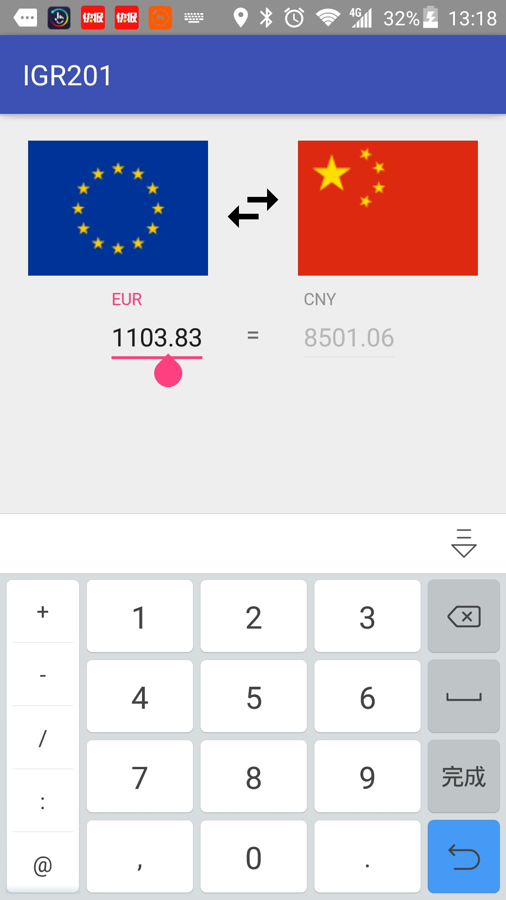

# IGR HOEMWORK - Exchange Rate

## How to use it!

This program allow us to get the exchange rate in real time and perform the currency conversion automatically.
 

	

You type the amount in the text editor, the program will performe the currency conversion automatically and show the resultat in the right side. If you want to change the direction de conversion, just click the exchange button .

If you want to change the currency type, you can click the country flag, then you will get into the following activity.

	

This activity show all the available currency in our application. If your network is availble, our application will retrieve currency exchange rates from [openexchangerates](https://openexchangerates.org).
If not, our application will ues the off-line data.

## Attention
I have no time to add the code in order to get the permission dynamically in my application. So the apps maybe encounters some problem when it run in a android 6 ou 7 mobile. 