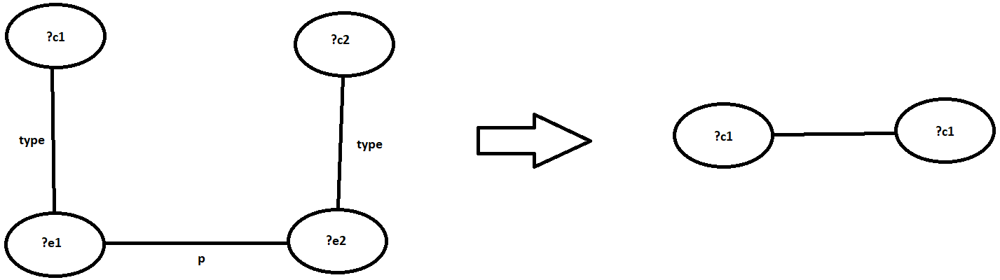
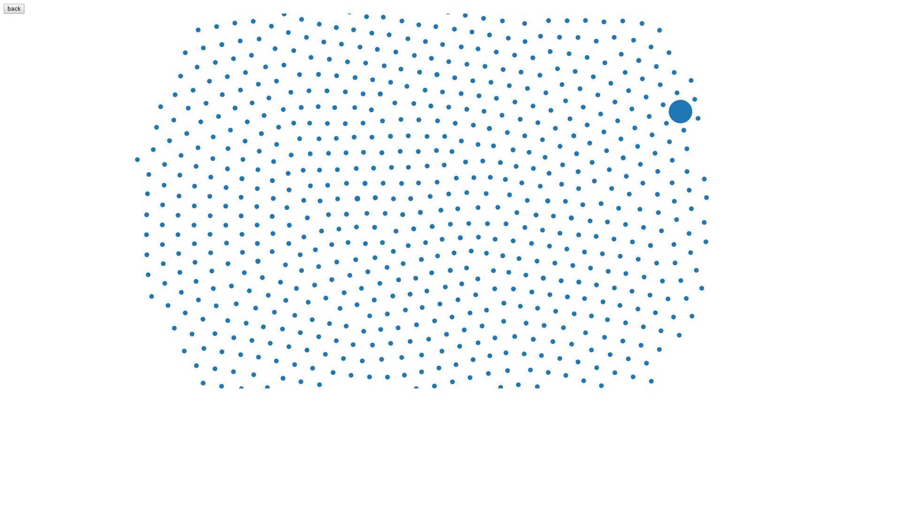
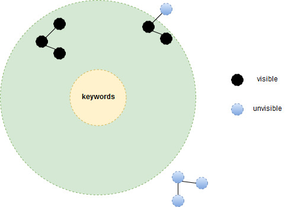

# IGR205-Séminaires de projets

**Interactions sur des graphes de connaissances interconnectés**

Site pédagogique: [Liste des projets](https://perso.telecom-paristech.fr/jthiery/cours/igr205/igr205.html)

Work space: [Google Drive](https://drive.google.com/open?id=1SBImnKs75XvDbojn9aVy144yBejnYwrB)

## Encadrants

[Jean-Claude Moissinac](https://moissinac.wp.imt.fr/)

[James R. Eagan](https://perso.telecom-paristech.fr/eagan/)

## Membres

[ROBINEAU Corentin](https://github.com/AlwaysFurther)

[ZHANG Bolong](https://github.com/BolongZHANG)

[ZHU Fangda](https://github.com/zhufangda)

[BAO Yukun](https://github.com/baoyukun)

## Domaines

`Graph mining`, `Ontology`, `Visualization`, `Informatique`, `Programmation`

## Introduction

De nombreux travaux visent à produire des graphes de connaissances interconnectés. Cette tendance est communément appelée Linked Open Data ou LOD. Des principes généraux simples -le modèle RDF- permettent de représenter des connaissances dans un graphe -KG, pour Knowledge Graph- et de relier simplement ces connaissances à d'autres présentes dans d'autres graphes. Le graphe le plus connu, et auquel se lient de nombreux autres est DBPedia, un graphe constitué à partir de nombreux faits extraits de WikiPedia.
Un nombre grandissant d'entreprises et de centres de recherche travaillent à établir des méthodes pour exploiter ces graphes. Dans ce projet, nous allons nous focaliser sur les visualisations et les interactions possibles et utiles sur de tels graphes.
Pour ce projet, le jeu de données SemBib sera exploité, en liaison avec d'autres comme HAL, DBPedia, Orcid... Sembib est un ensemble de graphes de connaissances décrivant les près de 12000 publications scientifiques produites par Telecom ParisTech depuis 1969. D'autres ensembles de données pourront être proposés.
Le but va être d'explorer différentes possibilités pour la visualisation et l'exploration de tels ensembles de données et d'analyser les avantages et les inconvénient de différentes approches existantes. L'article en référence est une bonne base sur ce sujet ; d'autres pistes seront proposées et enfin, d'autres pourront être explorées à l'initiative du groupe.


## How to use:
Pour voir le visualization, clique le [lien](visualisation_module/demo_final/README.md)
 
## Développement du projet

- [**Semaine 1**](#semaine-1)
- [**Semaine 2**](#semaine-2)
- [**Semaine 3**](#semaine-3)
- [**Semaine 4**](#semaine-4)
- [**Semaine 5**](#semaine-5)


### Semaine 1
**28/05-01/06**

#### Partie algorithme

Nous avons tout d’abord effectué des recherches afin de trouver des articles intéressants sur les différentes manières d’explorer les graphes RDF. Au début, nous souhaitions essayer d’explorer le graphe tout entier cependant, nous nous sommes vite rendu compte que les graphes RDF sont pour la plupart beaucoup trop volumineux. Ainsi, nous avons commencé à nous pencher sur les techniques permettant de faire des requêtes qui renvoient les éléments du graphes correspondant à une demande d’un utilisateur. Nous avons décidé que cette demande se ferait sous la forme de mots clefs. Dans beaucoup de papiers et d’exemples, les algorithme reposait sur une connaissance préalable de la structure du graphe à savoir, les principales classes et prédicats. Cependant, nous souhaitions créer un algorithme universelles qui puissent découvrir la structure du graphe.

Après plusieurs recherches, nous avons porté notre attention sur l’article [Top-k Exploration of Query Candidates for Efficient Keyword Search on Graph-Shaped (RDF) Data](https://ieeexplore.ieee.org/stamp/stamp.jsp?arnumber=4812421).

Les étapes principales sont les suivantes:

- Le mapping des mots clefs aux éléments du graphes RDF
- La création d’un graphe “résumé” du graphe d’origine
- L’exploration de ce graphe pour trouver des sous graphes connectant les mots clefs
- Détermination des top-k graphes (les meilleurs) par l'intermédiaire d’une fonction d’évaluation
- Génération des requêtes SPARQL pour les top-k graphes

Le graphe “résumé” est un graphe constitué seulement des sommets de type classe du graphe d’origine. Les arêtes de ce graphe sont les arêtes (prédicats) du graphes d’origine qui relient des entités. Un projet appartenant à la classe Project est une entité. En effet, ce n’est pas un attribut / donnée car ce projet est composé d’un nom, d’une date de publication,etc. Ces derniers en revanche sont des données.



Par `Yukun BAO` et `Corentin ROBINEAU`

#### Partie visualisation
Comme on decide de l'utiliser le D3 comme un outil de visualisation, nous deux commence à étudier D3 systématiquement afin de bien comprendre son mécanisme. Après plusier de recherche, nous deux ont porré par livre  [Interactive Data Visualization for the Webs](http://shop.oreilly.com/product/0636920026938.do). On a suivi ce livre et refait des examples proposés par ce livre. Vous pouvez trouver la trace dans le [dossier](visualisation_module/demo_datamusse/js).

Par `Bolong ZHANG` et `Fangda ZHU`

[*Retour au calendrier*](#développement-du-projet)

### Semaine 2
**04/06-08/06**

#### Partie algorithme

Nous sommes intéressés par la question: Comment explorer un large graphe RDF efficacement et intuitivement. SPARQL est un langage prédominant pour réaliser des requêtes sur les graphes RDF. Cependant, il demande à l’utilisateur d'avoir une connaissance parfaite de la syntaxe mais aussi de la structure du graphe.

Avec l’algorithme suivant , nous voudrions combiner la recherche par mots clefs avec le langage de requête SPARQL. Etant donnée une requête (Q , q) où Q est une requête SPARQL et q et un ensemble de mots clés, nous supposons que la force de relation de la réponse dépend de la longueur du chemin . En fait, des prédicats différents devrait avoir des poids différents pour la force de relation et cela peut être mesuré par une métrique de distance. Un autre challenge pour résoudre ce problème et l'efficacité de la recherche. Une recherche exhaustive peut se dérouler de la façon suivante: On cherche tous les sous graphes qui match la requête Q puis on calcul le plus court chemin entre ces sous graphes et les sommets qui contiennent les keyword. Evidemment, c’est une solution inefficace en pratique. On peut trouver les match de la requête Q avec des heuristiques afin de stopper le processus de recherche le plus tôt possible. De plus, on peut utiliser un schéma de reconnaissance séquentiel afin d’élaguer les branches de recherches. Enfin, pour accélérer le calcul de la distance, on peut sélectionner des pivots et les considérer comme des racines indépendantes dans l’arbre de recherche.

Quelques exemples de keyword+query pour que vous puissiez comprendre ce que l'on voudrais demander sur les données:

nom de fichier | contenu | interprétation
--- | --- | ---
dblp_Q1.txt | `Jian Pei; Wen Jin\n select * where    { ?paper <http://swrc.ontoware.org/ontology#year> "2005" . ?paper <http://swrc.ontoware.org/ontology#booktitle> "@@VLDB" . ?paper <http://purl.org/dc/elements/1.1/creator> ?person2 .    }` | Qui a écrit une papier nommé VLDB en 2005 et garde une bonne relation avec Jian Pei et Wen Jin?
dblp_Q2.txt | `Skyline\n select * where    { ?paper <http://swrc.ontoware.org/ontology#year> "2005" . ?paper <http://swrc.ontoware.org/ontology#booktitle> "@@VLDB" . ?paper <http://purl.org/dc/elements/1.1/creator> ?person1 . ?paper <http://purl.org/dc/elements/1.1/creator> ?person2 .    }` | Quels deux chercheurs ont fait des recherches sur Skyline et co-écrit un article dans VLDB 2005?
yago_Q1.txt | `Peking\n select * where    { ?p    <http://mpii.de/yago/resource/actedIn>    ?f1 . ?p    <http://mpii.de/yago/resource/created>    ?f2 . ?f1    rdf:type    <http://mpii.de/yago/resource/wikicategory_Comedy_films> . ?f2    <http://mpii.de/yago/resource/hasProductionLanguage>    <http://mpii.de/yago/resource/English_language>    . }` | Quels producteurs de films anglais ont joué dans un film de comédie et se sont liés à l'université de Pékin?
yago_Q2.txt | `Toronto; database\n select * where    {?p    <http://www.w3.org/1999/02/22-rdf-syntax-ns#type>    <http://mpii.de/yago/resource/wordnet_scientist_110560637> . ?p    <http://mpii.de/yago/resource/hasWonPrize>    ?a . ?a    <http://www.w3.org/2000/01/rdf-schema#label>    "Turing Award"    . }` | Quels lauréats du prix Turing dans le domaine de la base de données sont principalement liés à Toronto?

On commence par un indexage hors ligne où les donnée du graphe sont traitées et placées dans des structures de données spécifiques. Du point de vue du graphe, les mots clefs peuvent faire référence à des C-Vertices ( les classes ),  des E-Vertices ( les entités ) ou des V-vertices ( les données ) et les arêtes du graphe. Nous ne nous intéresserons pas aux E-vertices dans le processus d’indexage car on peut supposer qu’il est peu probable que les utilisateurs utilisent la verbose des URI d’une E-Vertex. Afin de reconnaître aussi les mots clefs qui ne match pas exactement avec les données, la structure de donnée qui map les élément du graphe au kley word est implémentée sous la forme d’un index inversé. Ainsi, la structure de donnée va analyser un mot clef et retourner une liste d’éléments qui ont des labels avec une sémantique ou une syntaxe similaire.

Par `Yukun BAO` et `Corentin ROBINEAU`

#### Partie visualisation
Nous avons continué à étudié la D3 et on constate que la froce-graph bien répond à notre besion. Par conseqent, on cherche des démo sur l'internet et le tester pour inspiré.

 visualisation, on doit bien connaitre la structure de graph. On a commencé à travailler sur la base de donnée **sembib**.  On tout d'abord analyser ce base de donnée à l'aide de python package [networkx](https://networkx.github.io/). On trouve que ce database contient plusieur sous composent independant. Du coup, on crée mon [premier demo](visualisation_module/demo_datamusse/index.html) pour visulaliser cette charactéristique.

Dans la première vue, Vous pouvez voir centaine cercles indépendant sur ce graph. Chaque cricle est un composante faible connexe. Si on clique sur ces cercle, on peut voir le detail de ce composants.

Par `Bolong ZHANG` et `Fangda ZHU`

[*Retour au calendrier*](#développement-du-projet)


### Semaine 3
**11/06-15/06**

#### Partie algorithme

La partie principale de l’algorithme consiste en trois parties. Tout d’abord, on explore le graphe pour trouver des sommets qui connectent les sommets “mot clef”. Ensuite, on génère des match à partir des sommets connectant les sommets “mot clef” et on obtient des centaines de milliers de sous graphes( graphe résumé ). Pour finir, on extrait les top-k sous graphes qui correspondent le mieux au mots clefs de l'utilisateur. Lors de l’exploration du graphe, pour chaque mot clef on a une file de priorité de triplets (sommet , chemin vers un sommet “mot clef” , longueur du chemin). Tous les éléments sont triés dans l’ordre non descendant de la longueur du chemin. Chaque mot clef est aussi associé à un ensemble de résultats dans lequel on peut trouver tous les sommets visibles avec un chemin de longueur inférieur à l’infinie.



Par `Yukun BAO` et `Corentin ROBINEAU`

#### Partie visualisation
Cette semaine, on a travaillé sur **sembib**.
On a essayé d'utiliser autre type graph pour visulasation, par example, tree ou chord. 

On trouve que la base de donnée, sembib, contiens plusier composant indépendant. Chaque composant est un sous-graph 
On écrit une programme afin de tester tous les sous-graphe.  A l'aide de python package [networkx](https://networkx.github.io/), on trouve que plus part de sous-graph ne contiens pas un "spanning arborescence". C'est à dire il n'est pas possible de créer une tree comme ue visualisation général pour **sembib**.

On tente de faire un chord avec ces données. Afin de realiser ce graph, il faut attribuer chaque node un "type" indiqué la group de de ce node. Mais les collègues qui travaillent sur la partie algorithme nous ont dit que il n'est pas possible de  attribuer chaque node un type. Donc, on ne pouvez pas créer une chrod comme une visualisation géneral.

Par `Bolong ZHANG` et `Fangda ZHU`

[*Retour au calendrier*](#développement-du-projet)

### Semaine 4
**18/06-22/06**

#### Partie algorithme

Pour la génération des match de sous graphes, on utilise un algorithme basé sur le parcours en profondeur pour réaliser le processus de matching en commençant par un sommet v qui est directement visible par le sommet “mot clef”.  Supposons que v match un sommet u dans la requête Q, alors on cherche le graphe pour atteindre le voisin de v qui est un voisin de u et dont l'arête qui les relies est une arête de la requête. Le recherche va s’étendre pas à pas jusqu’à ce que l’on trouve un match ou que l’on ne puisse plus continuer. Pour accélérer la traversée, on sélectionne des sommets que l’on appellera pivots et on calcul les arbres de plus courts ayant pour racine ces pivots. Si la traversée rencontre un pivot, on peut utiliser l’arbre de plus court chemin afin d’explorer l’espace. Enfin, afin de calculer les top-k match, on commence par calculer le coût des match avec les sous graphes pour lesquels les sommets sont directement visibles par les mots clefs, ce qui peut mener à un seuil d’évaluation représentant le k-ième plus petit coût jusqu'à maintenant. Quand il y a moins de k match de ce type, le seuil devrait être infinie. Si le seuil est inférieur à toutes les évaluations des match où tous les sommets ne sont pas visible directement par les mots clefs, l'algorithme s’arretera et renverra les résultats qu’il a trouvé, sinon l’algorithme entame la prochaine itération.

On remarque que les résultats du graphe résumé retournés par l’algorithme sont des triplets et ils peuvent être visualisés comme un graphe. Les réponses à la requête Q ne sont pas nécessairement liées directement aux variables dans la question des utilisateurs. Cependant on peut donner une autre requête de mots clefs et l’algorithme prendra en compte les réponses précédentes ainsi que les nouvelles variables . Ainsi, le deuxième graphe résumé retourné par l’algorithme révèlera de façon intuitive le lien logique entre les réponse et la question.

Par `Yukun BAO` et `Corentin ROBINEAU`

#### Partie visualisation
Dans cette semaine, on décide de crée un outil visualisation afin de visualiser n'import quel base de donnée.
Ce outil recois le fichier de rdf sous format json, et le visualise. Vous pouvez trouver la l'introduction sur ce outil dans [ce lien](visualisation_module/demo_final/README.md).

Sachant que mes collégue propose des différent de method pour obtenir la graphe résumé. Afin d'adapter cette demande, on crée un page de web inspiré par le travail de `Corentin` en cours IGR204. 

Par `Fangda ZHU` et `Bolong Zhang`

[*Retour au calendrier*](#développement-du-projet)


### Semaine 5
**25/06-29/06**

#### Partie algorithme

On a exporté le programme dans un seul fichier jar, nommé `algo-windows.jar` (et `algo-linux.jar` pour Linux) que vous pouvez appeler dans le terminal. Les deux versions utilisent un exécutable de l'algorithme FP growth compilé respectivement sous Windows et Linux.

Comment ça marche:
- `git clone <https://xxx>` et vous trouverez un répertoire **workspace** où se trouvent toutes les choses nécessaires pour l'exécution;
- information utile:
```shell
java -classpath algo-windows.jar Indexing -h
java -classpath algo-windows.jar SparqlQuery -h
java -classpath algo-windows.jar SummaryGraph -h
```
- exécution:
```shell
java -classpath algo-windows.jar Indexing data/sembib.nt 200 0
java -classpath algo-windows.jar SparqlQuery data/sembib_Q1.txt 10
java -classpath algo-windows.jar SummaryGraph data/sembib.nt data/sembib_Q1.txt 20
```

**Attention**:
- Chaque fois quand vous voulez changer le database (sembib, DBLP, Yago...), vous devez exécuter d'abord `Indexing`, c'est la première chose à faire;
- Il y a `structrual index` dans `Indexing` qui est seulement nécessaire pour répondre à une query, et c'est lui qui prendra beaucoup de temps pour grandes données. Donc, choisissez de ne pas exécuter `structrual index` quand vous voulez juste tester le graph de résumé.
- Toute autre information, merci de bien lire les instructions en donnant `-h`.

Voici un résultat d'un petit démo sur `persons.nt`, une partie de sembib.

- distance = 10, keyword = "Moissinac"

```nt
<http://givingsense.eu/sembib/onto/persons/Moissinac_Jean-Claude> <http://xmlns.com/foaf/0.1/name> "Jean-Claude Moissinac"
<http://givingsense.eu/sembib/onto/persons/Moissinac_H_> <http://xmlns.com/foaf/0.1/name> "Jean-Claude Moissinac"
```
- distance = 10, keyword = "Moissinac;Thomas"

```nt
<http://givingsense.eu/sembib/onto/persons/Bonald_Thomas> <http://xmlns.com/foaf/0.1/name> "Thomas Bonald"
<http://givingsense.eu/sembib/onto/persons/ROBERT_Thomas> <http://xmlns.com/foaf/0.1/name> "Thomas ROBERT"
<http://givingsense.eu/sembib/onto/persons/Anfray_Th_> <http://xmlns.com/foaf/0.1/name> "Thomas Anfray"
<http://givingsense.eu/sembib/onto/persons/Risse_Th_> <http://xmlns.com/foaf/0.1/name> "Thomas Risse"
<http://givingsense.eu/sembib/onto/persons/Moissinac_Jean-Claude> <http://xmlns.com/foaf/0.1/name> "Jean-Claude Moissinac"
<http://givingsense.eu/sembib/onto/persons/Fillon_T_> <http://xmlns.com/foaf/0.1/name> "Thomas Fillon"
<http://givingsense.eu/sembib/onto/persons/Pietrzak_Th_> <http://xmlns.com/foaf/0.1/name> "Thomas Pietrzak"
<http://givingsense.eu/sembib/onto/persons/Thomas_S_> <http://xmlns.com/foaf/0.1/name> "Albert Thomas"
<http://givingsense.eu/sembib/onto/persons/Engel_Th_> <http://xmlns.com/foaf/0.1/name> "Thomas Engel"
<http://givingsense.eu/sembib/onto/persons/Hueber_T_> <http://xmlns.com/foaf/0.1/name> "Thomas Hueber"
<http://givingsense.eu/sembib/onto/persons/Hurtut_T_> <http://xmlns.com/foaf/0.1/name> "Thomas Hurtut"
<http://givingsense.eu/sembib/onto/persons/Maugey_T_> <http://xmlns.com/foaf/0.1/name> "Thomas Maugey"
<http://givingsense.eu/sembib/onto/persons/Thomas_E_> <http://xmlns.com/foaf/0.1/name> "Albert Thomas"
<http://givingsense.eu/sembib/onto/persons/Courtat_Th_> <http://xmlns.com/foaf/0.1/name> "Thomas Courtat"
<http://givingsense.eu/sembib/onto/persons/Janssoone_Th_> <http://xmlns.com/foaf/0.1/name> "Thomas Janssoone"
<http://givingsense.eu/sembib/onto/persons/Thomas_A_> <http://xmlns.com/foaf/0.1/name> "Albert Thomas"
<http://givingsense.eu/sembib/onto/persons/Vergnaud_Th_> <http://xmlns.com/foaf/0.1/name> "Thomas Vergnaud"
<http://givingsense.eu/sembib/onto/persons/Lawson_Th_> <http://xmlns.com/foaf/0.1/name> "Thomas Lawson"
<http://givingsense.eu/sembib/onto/persons/Andr%C3%A9_E_> <http://xmlns.com/foaf/0.1/name> "Thomas Andr\u00E9"
<http://givingsense.eu/sembib/onto/persons/Laich_Th_> <http://xmlns.com/foaf/0.1/name> "Thomas Laich"
<http://givingsense.eu/sembib/onto/persons/Zemen_Th_> <http://xmlns.com/foaf/0.1/name> "Thomas Zemen"
<http://givingsense.eu/sembib/onto/persons/HOUY_Thomas> <http://xmlns.com/foaf/0.1/name> "Thomas HOUY"
<http://givingsense.eu/sembib/onto/persons/Gaujoux_Th_> <http://xmlns.com/foaf/0.1/name> "Thomas Gaujoux"
<http://givingsense.eu/sembib/onto/persons/Andr%25C3%25A9_J_%2520C_> <http://xmlns.com/foaf/0.1/name> "Thomas Andr\u00E9"
<http://givingsense.eu/sembib/onto/persons/Moissinac_H_> <http://xmlns.com/foaf/0.1/name> "Jean-Claude Moissinac"
<http://givingsense.eu/sembib/onto/persons/Thomas_J_> <http://xmlns.com/foaf/0.1/name> "Albert Thomas"
<http://givingsense.eu/sembib/onto/persons/Quinot_T_> <http://xmlns.com/foaf/0.1/name> "Thomas Quinot"
<http://givingsense.eu/sembib/onto/persons/Thomas_O_> <http://xmlns.com/foaf/0.1/name> "Albert Thomas"
<http://givingsense.eu/sembib/onto/persons/H%25C3%25A9lie_T_> <http://xmlns.com/foaf/0.1/name> "Thomas H\u00E9lie"
<http://givingsense.eu/sembib/onto/persons/Andr%25C3%25A9_T_> <http://xmlns.com/foaf/0.1/name> "Thomas Andr\u00E9"
<http://givingsense.eu/sembib/onto/persons/Sikora_T_> <http://xmlns.com/foaf/0.1/name> "Thomas Sikora"
<http://givingsense.eu/sembib/onto/persons/Lavergne_Th_> <http://xmlns.com/foaf/0.1/name> "Thomas Lavergne"
<http://givingsense.eu/sembib/onto/persons/Rocher_Th_> <http://xmlns.com/foaf/0.1/name> "Thomas Rocher"
<http://givingsense.eu/sembib/onto/persons/Icart_T_> <http://xmlns.com/foaf/0.1/name> "Thomas Icart"
<http://givingsense.eu/sembib/onto/persons/Andr%25C3%25A9_F_> <http://xmlns.com/foaf/0.1/name> "Thomas Andr\u00E9"
```
- distance = 20, keyword = "Moissinac"

```nt
<http://givingsense.eu/sembib/onto/persons/Moissinac_Jean-Claude> <http://www.w3.org/1999/02/22-rdf-syntax-ns#type> <http://xmlns.com/foaf/0.1/Person>
<http://givingsense.eu/sembib/onto/persons/Moissinac_Jean-Claude> <http://purl.org/spar/pro/holdsRoleInTime> <http://givingsense.eu/sembib/onto/persons/Moissinac_Jean-Claude-author>
<http://givingsense.eu/sembib/onto/persons/Moissinac_Jean-Claude> <http://purl.org/spar/pro/holdsRoleInTime> <http://givingsense.eu/sembib/onto/persons/Moissinac_Jean-Claude-at-tpt>
<http://givingsense.eu/sembib/onto/persons/Moissinac_Jean-Claude> <http://xmlns.com/foaf/0.1/familyName> "Moissinac"
<http://givingsense.eu/sembib/onto/persons/Moissinac_Jean-Claude> <http://xmlns.com/foaf/0.1/givenName> "Jean-Claude"
<http://givingsense.eu/sembib/onto/persons/Moissinac_Jean-Claude> <http://xmlns.com/foaf/0.1/name> "Jean-Claude Moissinac"
<http://givingsense.eu/sembib/onto/persons/Moissinac_H_> <http://www.w3.org/1999/02/22-rdf-syntax-ns#type> <http://xmlns.com/foaf/0.1/Person>
<http://givingsense.eu/sembib/onto/persons/Moissinac_H_> <http://xmlns.com/foaf/0.1/familyName> "Moissinac"
<http://givingsense.eu/sembib/onto/persons/Moissinac_H_> <http://xmlns.com/foaf/0.1/givenName> "Jean-Claude"
<http://givingsense.eu/sembib/onto/persons/Moissinac_H_> <http://xmlns.com/foaf/0.1/name> "Jean-Claude Moissinac"
```

Par `Yukun BAO` et `Corentin ROBINEAU`


#### Partie visualisation
Cette semaine, on a fixé des bugs dans notre programme ,a continué à faire des améliorations sur la version finale et a ajouté plus d'interaction. Pour plus de detail et demonstration, je vous conseille fortement de voir le [rapport](https://github.com/BolongZHANG/IGR205_Graphes/blob/master/Interactions%20sur%20des%20graphes%20de%20connaissances%20interconnect%C3%A9s.pdf)

Par `Fangda ZHU` et `Bolong Zhang`

[*Retour au calendrier*](#développement-du-projet)

## Reference

- [Exploration and Visualization in the Web of Big Linked Data: A Survey of the State of the Art](https://arxiv.org/pdf/1601.08059.pdf)
- [Top-k Exploration of Query Candidates for Efficient Keyword Search on Graph-Shaped (RDF) Data](https://ieeexplore.ieee.org/stamp/stamp.jsp?arnumber=4812421)
